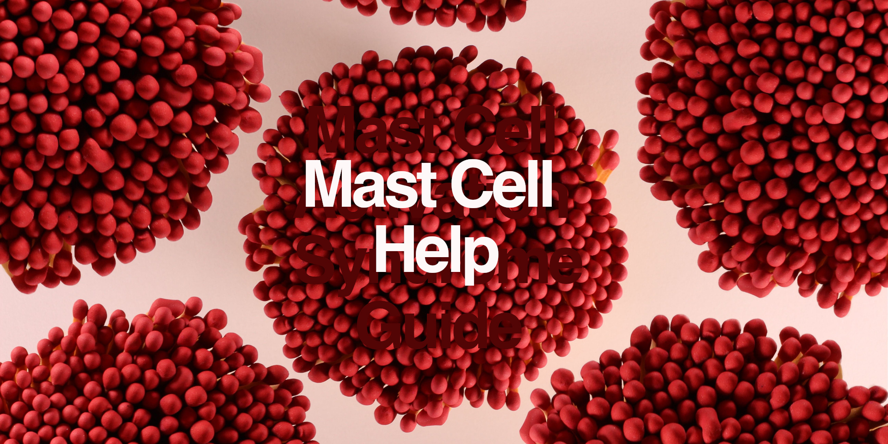

# Mast Cell Help

Mast Cell Help: this guide is for mast cell information about health symptoms, diagnoses, treatments, medications, conditions, and supportive measures. This guide explains one topic per page, like a big glossary, easy wiki, quick encyclopedia, or summary notes.

* Get the book:
  [Free EPUB](https://github.com/SixArm/mast-cell-help/raw/main/mast-cell-help.epub),
  [Free PDF](https://github.com/SixArm/mast-cell-help/raw/main/mast-cell-help.pdf),
  [Kindle](https://www.amazon.com/dp/B0CMNW438Z),
  [Paperback](https://www.amazon.com/dp/B0CRZ8VWLG).
* Edited by [Joel Parker Henderson](https://github.com/joelparkerhenderson).
* For questions and suggestions [email me](mailto:joel@joelparkerhenderson.com).
* For donations [PayPal me](https://paypal.me/joelparkerhenderson) or [Venmo me](https://account.venmo.com/u/joelparkerhenderson).

## Contents

### [Introduction](topics/introduction/)

### [Start here](topics/start-here/)

* [Start here for safe foods](topics/start-here-for-safe-foods/)
* [Start here for nutrition](topics/start-here-for-nutrition/)
* [Start here for triggers](topics/start-here-for-triggers/)
* [Start here with pharmacists](topics/start-here-with-pharmacists/)
* [Start here with doctors](topics/start-here-with-doctors/)

### [What are mast cells?](topics/what-are-mast-cells/)

* [Where are mast cells?](topics/where-are-mast-cells/)
* [What doctors and providers can help?](topics/what-doctors-and-providers-can-help/)
* [How to find a doctor or provider?](topics/how-to-find-a-doctor-or-provider/)
* [Support groups](topics/support-groups/)
* [Facebook groups](topics/facebook-groups/)

### [Mast cell activation syndrome (MCAS)](topics/mast-cell-activation-syndrome/)

* [Symptoms](topics/mast-cell-activation-syndrome-symptoms/)
* [Diagnosis](topics/mast-cell-activation-syndrome-diagnosis/)
* [Diagnosis via clinical evaluation](topics/mast-cell-activation-syndrome-diagnosis-via-clinical-evaluation/)
* [Diagnosis via laboratory tests](topics/mast-cell-activation-syndrome-diagnosis-via-laboratory-tests/)
* [Diagnosis consensus 2 criteria](topics/mast-cell-activation-syndrome-diagnosis-consensus-2-criteria/)
* [Severity](topics/mast-cell-activation-syndrome-severity/)
* [Treatments](topics/mast-cell-activation-syndrome-treatments/)
* [Medications](topics/mast-cell-activation-syndrome-medications/)
* [Dietary modifications](topics/mast-cell-activation-syndrome-dietary-modifications/)
* [Supportive measures](topics/mast-cell-activation-syndrome-supportive-measures/)
* [Differential diagnoses](topics/mast-cell-activation-syndrome-differential-diagnoses/)
* [Mast cell activation syndrome (MCAS) versus histamine intolerance (HI)](mast-cell-activation-syndrome-versus-histamine-intolerance)

### [Inflammation](topics/inflammation/)

* [Histamine](topics/histamine/)
* [Histamine bucket](topics/histamine-bucket/)
* [Histamine liberators](topics/histamine-liberators/)
* [Antihistamines](topics/antihistamines/)
* [Antihistamines: types](topics/antihistamine-types/)
* [Diamine oxidase](topics/diamine-oxidase/)
* [Tryptase](topics/tryptase/)
* [Heparin](topics/heparin/)
* [C-reactive protein (CRP)](topics/c-reactive-protein/)
* [Interleukin-6 (IL-6)](topics/interleukin-6/)

### [Alternative therapies](topics/alternative-therapies/)

* [Integrative medicine](topics/integrative-medicine/)
* [Complementary and alternative medicine (CAM)](topics/complementary-and-alternative-medicine/)
* [Compounding pharmacy](topics/compounding-pharmacy/)
* [Bespoke boutiques](topics/bespoke-boutiques/)
* [Somatic Experiencing (SE)](topics/somatic-experiencing/)
* [Graded Exercise Therapy (GET)](topics/graded-exercise-therapy/)
* [Ketamine therapy](topics/ketamine-therapy/)
* [Ibogaine therapy](topics/ibogaine-therapy/)
* [Low-dose naltrexone (LDN)](topics/low-dose-naltrexone/)
* [Myers' Cocktail](topics/myers-cocktail/)
* [Nicotinamide adenine dinucleotide (NAD+) intravenous (IV) therapy](topics/nicotinamide-adenine-dinucleotide-intravenous-therapy/)
* [Gut-brain connection](topics/gut-brain-connection/)
* [Daith piercing](topics/daith-piercing/)
* [Frequency-specific microcurrent (FSM)](topics/frequency-specific-microcurrent/)
* [Fecal microbiota transplantation (FMT)](topics/fecal-microbiota-transplantation/)
* [Ozone therapy](topics/ozone-therapy/)
* [Red light therapy](topics/red-light-therapy/)
* [Patient advocates](topics/patient-advocates/)

### [Traditional Chinese Medicine (TCM)](topics/traditional-chinese-medicine/)

* [Acupuncture](topics/acupuncture/)
* [Cupping](topics/cupping/)
* [Qigong](topics/qigong/)
* [Tai Chi](topics/tai-chi/)
* [Tui Na](topics/tui-na/)
* [Nambudripad's Allergy Elimination Technique (NAET)](topics/nambudripads-allergy-elimination-technique/)
* [Soliman Auricular Allergy Treatment (SAAT)](topics/soliman-auricular-allergy-treatment)

### [Functional medicine](topics/functional-medicine/)

* [Functional medicine matrix](topics/functional-medicine-matrix/)
* [Functional medicine timeline](topics/functional-medicine-timeline/)
* [Functional medicine GOTOIT framework](topics/functional-medicine-gotoit-framework/)

### [Trigger cleaning](topics/trigger-cleaning/)

* [Trigger triage](topics/trigger-triage/)
* [Household triggers](topics/household-triggers/)
* [Chemical triggers](topics/chemical-triggers/)
* [Environmental triggers](topics/environmental-triggers/)
* [Food triggers](topics/food-triggers/)
* [Water triggers](topics/water-triggers/)
* [Car triggers](topics/car-triggers/)
* [Allergens, irritants, toxins](topics/allergens-irritants-toxins/)
* [Air filters](topics/air-filters/)
* [Water filters](topics/water-filters/)
* [Activated carbon filters](topics/activated-carbon-filters/)
* [Volatile organic compounds (VOCs)](topics/volatile-organic-compounds/)
* [GreenGuard certification](topics/greenguard-certification/)
* [Ventilation](ventilation)

### [Stress Management](topics/stress-management/)

* [Meditation](topics/meditation/)
* [Progressive Muscle Relaxation (PMR)](progressive-muscle-relaxation)
* [Self-soothing](topics/self-soothing/)
* [Sleep hygiene](topics/sleep-hygiene/)
* [SHINE protocol](topics/shine-protocol/)
* [Cognitive-Behavioral Therapy (CBT)](topics/cognitive-behavioral-therapy/)
* [Dialectical Behavior Therapy (DBT)](topics/dialectical-behavior-therapy/)
* [Eye Movement Desensitization and Reprocessing (EMDR)](topics/eye-movement-desensitization-and-reprocessing/)
* [Buteyko breathing method](topics/buteyko-breathing-method/)
* [Rapid Resolution Therapy (RRT)](rapid-resolution-therapy)
* [The Spoon Theory](the-spoon-theory)

### [Vagus nerve reset](topics/vagus-nerve-reset/)

* [Vagal tone stimulation](topics/vagal-tone-stimulation)
* [Polyvagal theory](topics/polyvagal-theory/)
* [Polyvagal exercises](topics/polyvagal-exercises/)

### [Limbic system retraining](topics/limbic-system-retraining/)

* [Gupta Brain Retraining](topics/gupta-brain-retraining/)
* [Dynamic Neural Retraining System (DNRS)](topics/dynamic-neural-retraining-system/)

### [Food diary](topics/food-diary/)

* [Elemental diet](topics/elemental-diet/)
* [Ketogenic diet](topics/ketogenic-diet/)
* [Carnivore diet](topics/carnivore-diet/)
* [FAILSAFE diet (aka RPAH diet)](topics/failsafe-diet)
* [Autoimmune Protocol (AIP) diet](topics/autoimmune-protocol-diet/)
* [Gut and Psychology Syndrome (GAPS) diet](topics/gut-and-psychology-syndrome-diet/)
* [Swiss Interest Group Histamine Intolerance (SIGHI) diet](topics/swiss-interest-group-histamine-intolerance-diet/)
* [Whole food plant-based (WFPB) diet](topics/whole-food-plant-based-diet/)
* [Metabolic Type diet](topics/metabolic-type-diet/)
* [Intermittent fasting (IF)](topics/intermittent-fasting/)
* [Total parenteral nutrition (TPN)](topics/total-parenteral-nutrition/)
* [Histamine metabolism of foods](topics/histamine-metabolism-of-foods/)
* [Nutrigenomics](topics/nutrigenomics/)

### [Elimination diet](topics/elimination-diet/)

* [Low-histamine diet](topics/low-histamine-diet/)
* [Low-allergen diet](topics/low-allergen-diet/)
* [Low-amylose diet](topics/low-amylose-diet/)
* [Low-oxalate diet](topics/low-oxalate-diet/)
* [Low-lectin diet](topics/low-lectin-diet/)
* [Low-FODMAP diet](topics/low-fodmap-diet/)
* [Low-salicylate diet](topics/low-salicylate-diet/)
* [Low-sodium diet](topics/low-sodium-diet/)

### [Dietary supplements](topics/dietary-supplements/)

* [Considerations](topics/dietary-supplements-considerations/)
* [Electrolytes](topics/electrolytes/)
* [Superfoods](topics/superfoods/)
* [Macronutrients and micronutrients](topics/macronutrients-and-micronutrients/)
* [Nutritional shakes](topics/nutritional-shakes/)
* [Neocate Splash](topics/neocate-splash/)
* [Prebiotic supplements](topics/prebiotic-supplements/)
* [Probiotic supplements](topics/probiotic-supplements/)
* [Serrapeptase](topics/serrapeptase/)
* [Multivitamin](topics/multivitamin/)
* [Diamine oxidase supplements](topics/diamine-oxidase-supplements/)
* [Glutathione](topics/glutathione/)
* [Turmeric](topics/turmeric/)
* [Calcium](topics/calcium/)
* [Calcium D-glucarate](topics/calcium-d-glucarate/)
* [Chlorella](topics/chlorella/)
* [Copper](topics/copper/)
* [Iodine supplements](topics/iodine-supplements/)
* [Iron supplements](topics/iron-supplements/)
* [Lecithin](topics/lecithin/)
* [Magnesium supplements](topics/magnesium-supplements/)
* [Magnesium glycinate](topics/magnesium-glycinate/)
* [Potassium supplements](topics/potassium-supplements/)
* [Siberian pine nut oil](topics/siberian-pine-nut-oil/)
* [Sodium supplements](topics/sodium-supplements/)
* [Zinc](topics/zinc/)

### [Mast cell stabilizer supplements](topics/mast-cell-stabilizer-supplements)

* [Bromelain](topics/bromelain/)
* [N-acetyl cysteine (NAC)](topics/n-acetyl-cysteine/)
* [Omega-3](topics/omega-3/)
* [Quercetin](topics/quercetin/)

### [Vitamins](topics/vitamins)

* [Vitamin A (retinol)](topics/vitamin-a-retinol/)
* [Vitamin B1 (thiamine)](topics/vitamin-b1-thiamine/)
* [Vitamin B2 (riboflavin)](topics/vitamin-b2-riboflavin/)
* [Vitamin B3 (niacin)](topics/vitamin-b3-niacin/)
* [Vitamin B5 (pantothenic acid)](topics/vitamin-b5-pantothenic-acid/)
* [Vitamin B6 (pyridoxine)](topics/vitamin-b6-pyridoxine/)
* [Vitamin B7 (biotin)](topics/vitamin-b7-biotin/)
* [Vitamin B9 (folate)](topics/vitamin-b9-folate/)
* [Vitamin B12 (cobalamin)](topics/vitamin-b12-cobalamin/)
* [Vitamin C (ascorbic acid)](topics/vitamin-c-ascorbic-acid/)
* [Vitamin C (ascorbic acid) low-histamine forms](topics/vitamin-c-ascorbic-acid-low-histamine-forms/)
* [Vitamin D (calciferol)](topics/vitamin-d-calciferol/)
* [Vitamin E (tocopherol)](topics/vitamin-e-tocopherol/)
* [Vitamin K1 (phylloquinone)](topics/vitamin-k-phylloquinone/)
* [Vitamin K2 (menaquinone)](topics/vitamin-k2-menaquinone/)

### [Herbal supplements](topics/herbal-supplements/)

* [Berberine](topics/berberine/)
* [Butterbur](topics/butterbur/)
* [Stinging nettle](topics/stinging-nettle/)
* [Garlic](topics/garlic/)
* [Ginger](topics/ginger/)
* [Ginseng](topics/ginseng/)
* [Holy basil](topics/holy-basil/)
* [Khellin](topics/khellin/)
* [Milk thistle](topics/milk-thistle/)
* [Pinella](topics/pinella/)
* [Antimicrobial herbs](topics/antimicrobial-herbs/)

## Conditions

### [Histamine intolerance (HI)](topics/histamine-intolerance/)

* [Symptoms](topics/histamine-intolerance-symptoms/)
* [Dietary triggers](topics/histamine-intolerance-dietary-triggers/)
* [Diagnosis](topics/histamine-intolerance-diagnosis/)
* [Severity](topics/histamine-intolerance-severity/)
* [Treatments](topics/histamine-intolerance-treatments/)

### [Allergies](topics/allergies/)

* [Allergy types](topics/allergy-types/)
* [Allergy load](topics/allergy-load/)
* [Allergic reactions](topics/allergic-reactions/)
* [Allergy drops (a.k.a. sublingual immunotherapy)](topics/allergy-drops/)
* [Allergy shots (a.k.a. subcutaneous immunotherapy)](topics/allergy-shots/)
* [Textile dermatitis](topics/textile-dermatitis/)
* [Hypoallergenic products](topics/hypoallergenic-products/)
* [Avocado allergy](topics/avocado-allergy/)
* [Garlic allergy](topics/garlic-allergy/)
* [Gold allergy](topics/gold-allergy/)
* [Latex allergy](topics/latex-allergy/)
* [Marshmallow allergy](topics/marshmallow-allergy/)
* [Soy allergy ingredient names](topics/soy-allergy-ingredient-names/)
* [Wool allergy](topics/wool-allergy/)
  
### [Anaphylaxis](topics/anaphylaxis/)

* [Symptoms](topics/anaphylaxis-symptoms/)
* [Diagnosis](topics/anaphylaxis-diagnosis/)
* [Severity](topics/anaphylaxis-severity/)
* [Treatments](topics/anaphylaxis-treatments/)

### [Anaphylaxis emergency treatment](topics/anaphylaxis-emergency-treatment/)

* [Anaphylaxis emergency room](topics/anaphylaxis-emergency-room/)
* [Anaphylaxis emergency grades](topics/anaphylaxis-emergency-grades/)

### [Antiphospholipid syndrome (APS)](topics/antiphospholipid-syndrome/)

### [Asthma](topics/asthma/)

* [Symptoms](topics/asthma-symptoms/)
* [Triggers](topics/asthma-triggers/)
* [Diagnosis](topics/asthma-diagnosis/)
* [Severity](topics/asthma-severity/)
* [Treatments](topics/asthma-treatments/)
* [Lifestyle management](topics/asthma-lifestyle-management/)

### [Bartonellosis](topics/bartonellosis/)

### [Burning mouth syndrome (BMS)](topics/burning-mouth-syndrome/)

### [Chronic Inflammatory Response Syndrome (CIRS)](topics/chronic-inflammatory-response-syndrome/)

### [Chronic Fatigue Syndrome (CFS)](topics/chronic-fatigue-syndrome/)

### [Congenital Adrenal Hyperplasia (CAH)](topics/congenital-adrenal-hyperplasia/)

### [Contact allergic dermatitis](contact-allergic-dermatitis)

### [Cricopharyngeal spasm](topics/cricopharyngeal-spasm)

### [Diverticulosis](topics/diverticulosis/)

### [Dysautonomia](topics/dysautonomia/)

### [Dysbiosis](topics/dysbiosis/)

### [Ehlers-Danlos syndrome](topics/ehlers-danlos-syndrome/)

### [Endometriosis](topics/endometriosis/)

### [Endosalpingiosis](topics/endosalpingiosis/)

### [Eosinophilic esophagitis (EoE)](topics/eosinophilic-esophagitis/)

### [Ferroptosis](topics/ferroptosis/)

### [Gastroesophageal Reflux Disease (GERD)](topics/gastroesophageal-reflux-disease/)

### [Kounis syndrome](topics/kounis-syndrome/)

### [Leaky gut](topics/leaky-gut/)

### [Lyme disease with Borrelia, Bartonella, Babesia](topics/lyme-disease-with-borrelia-bartonella-babesia/)

* [Lyme disease](topics/lyme-disease/)
* [Borrelia](topics/borrelia/)
* [Bartonella](topics/bartonella/)
* [Babesia](topics/babesia/)

### [Mastocytosis](topics/mastocytosis/)

* [Cutaneous mastocytosis (CM)](topics/cutaneous-mastocytosis/)
* [Systemic mastocytosis (SM)](topics/systemic-mastocytosis/)
* [Indolent Systemic Mastocytosis (ISM)](topics/indolent-systemic-mastocytosis/)
* [Mast Cell Leukemia (MCL)](topics/mast-cell-leukemia/)

### [Mold exposure](mold-exposure)

### [Multiple Antibiotic Resistant Coagulase Negative Staphylococci (MARCoNS)](multiple-antibiotic-resistant-coagulase-negative-staphylococci)

### [Multiple Chemical Sensitivity (MCS)](topics/multiple-chemical-sensitivity/)

### [Multisystem Inflammatory Syndrome (MIS)](topics/multisystem-inflammatory-syndrome/)

### [Multisystem disease](topics/multisystem-disease/)

### [Polycystic Ovary Syndrome (PCOS)](topics/polycystic-ovary-syndrome/)

### [Postural Orthostatic Tachycardia Syndrome (POTS)](topics/postural-orthostatic-tachycardia-syndrome/)

### [Rheumatoid arthritis (RA)](topics/rheumatoid-arthritis/)

### [Systemic Mastocytosis with Associated Hematologic Neoplasm (SM-AHN)](systemic-mastocytosis-with-associated-hematologic-neoplasm)

### [Scar tissue adhesions](topics/scar-tissue-adhesions/)

### [Sjögren's syndrome](topics/sjogrens-syndrome/)

### [Sulfur intolerance](topics/sulfur-intolerance/)

### [Telangiectasia Macularis Eruptiva Perstans (TMEP)](topics/telangiectasia-macularis-eruptiva-perstans/)

### [Toxin exposure](topics/toxin-exposure/)

## Components

### [α-melanocyte stimulating hormone (α-MSH)](topics/α-melanocyte-stimulating-hormone/)

### [Aryl hydrocarbon receptors (AhR)](topics/aryl-hydrocarbon-receptors/)

### [Complement C3 protein](topics/complement-c3-protein)

### [Lysine-proline-valine (KPV)](topics/lysine-proline-valine/)

### [Immunoglobulin E (IgE)](topics/immunoglobulin-e/)

### [Immunoglobulin G (IgG)](topics/immunoglobulin-g/)

### [Phosphatidylcholine](topics/phosphatidylcholine/)

## Symptoms

### [Adrenal insufficiency](topics/adrenal-insufficiency/)

### [Adrenaline dumping](topics/adrenaline-dumping/)

### [Bradycardia](topics/bradycardia/)

### [Brain fog](topics/brain-fog/)

* [Brain fog suggestions](topics/brain-fog-suggestions/)

### [Bronchospasm](topics/bronchospasm/)

* [Bronchospasm treatment](topics/bronchospasm-treatment/)

### [Hypertryptasemia](topics/hypertryptasemia/)

### [Hypotension](topics/hypotension/)

* [Hypotension causes](topics/hypotension-causes/)

### [Presyncope](topics/presyncope/)

### [Diagnostics](topics/diagnostics/)

* [Allergy testing](topics/allergy-testing/)
* [Anti-IgE IgG test](topics/anti-ige-igg-test/)
* [Histamine testing](topics/histamine-testing/)
* [Complement C3 + C4 test](topics/complement-c3-c4-test/)
* [Complement C4-A blood test](topics/complement-c4-a-blood-test/)
* [Electrolyte blood serum test](topics/electrolyte-blood-serum-test/)
* [Mast cell tryptase stimulation test](topics/mast-cell-tryptase-stimulation-test/)
* [Imaging](topics/imaging)
* [Nasal swab](topics/nasal-swab/)
* [Nutrition testing](topics/nutrition-testing/)
* [Microbiome testing](topics/microbiome-testing/)
* [Genetic Environmental Illness (GENIE) test](genetic-environmental-illness-test)
* [N-methylhistamine test](topics/n-methylhistamine-test/)
* [Prostaglandin D2 (PGD2) test](topics/prostaglandin-d2-test/)
* [Serum tryptase test](topics/serum-tryptase-test/)
* [Bone marrow biopsy](topics/bone-marrow-biopsy/)
* [Treatment as test](topics/treatment-as-test/)

### [Mold exposure diagnostics](topics/mold-exposure-diagnostics/)

* [Environmental Relative Moldiness Index (ERMI)](topics/environmental-relative-moldiness-index/)
* [Health Effects Roster of Type-Specific Formers of Mycotoxins and Inflammagens - 2nd Version (HERTSMI-2)](topics/health-effects-roster-of-type-specific-formers-of-mycotoxins-and-inflammagens-2/)

## Treatment types

* [Medication suggestions](topics/medication-suggestions/)

### [Adrenaline](topics/adrenaline/)

### [Adrenaline emergency auto-injector](topics/adrenaline-emergency-auto-injector/)

### [Antihistamine medications](topics/antihistamine-medications/)

* [Azelastine](topics/azelastine/) (brand name: Astelin)
* [Bilastine](topics/bilastine/) (brand name: Blexten)
* [Cetirizine](topics/cetirizine/) (brand name: Zyrtec)
* [Chlorpheniramine](topics/chlorpheniramine/) (brand name: Chlor-Trimeton)
* [Cimetidine](topics/cimetidine) (brand name: Tagamet HB)
* [Clemastine](topics/clemastine/) (brand name: Tavist)
* [Cyproheptadine](topics/cyproheptadine/) (brand name: Periactin)
* [Desloratadine](topics/desloratadine/) (brand name: Clarinex)
* [Diphenhydramine](topics/diphenhydramine/) (brand name: Benadryl)
* [Fexofenadine](topics/fexofenadine/) (brand name: Allegra)
* [Histamine N-methyltransferase (HNMT)](topics/histamine-n-methyltransferase/)
* [Hydroxyzine](topics/hydroxyzine) (brand names: Atarax, Vistaril)
* [Ketotifen](topics/ketotifen/) (brand name: Zaditor)
* [Levocetirizine](topics/levocetirizine/) (brand name: Xyzal)
* [Loratadine](topics/loratadine/) (brand name: Claritin)
* [Olopatadine](topics/olopatadine/) (brand name: Patanase)
* [Promethazine](topics/promethazine/) (brand name: Phenergan)
* [Prednisone](topics/prednisone/) (brand name: Rayos)
* [Ranitidine](topics/ranitidine) (brand name: Zantac)

### [Antifungal medications](antifungal-medications)

* [Methylene blue](topics/methylene-blue/)

### [Anti-IgE therapy](topics/anti-ige-therapy)

* [Omalizumab](topics/omalizumab) (brand name: ??)

### [Asthma medications](topics/asthma-medications/)

* [Albuterol sulfate](topics/albuterol-sulfate/) (brand names: ProAir, Proventil, Ventolinr)
* [Omalizumab](topics/omalizumab/) (brand name: Xolair)
* [Guaifenesin](topics/guaifenesin/) (brand name: Mucinex)

### [Bile acid sequestrants](topics/bile-acid-sequestrants/)

* [Cholestyramine, Colesevelam, Colestipol)](topics/cholestyramine-colesevelam-colestipol/)
* [Cholestyramine (brand name: Questran)](topics/cholestyramine/)
* [Colesevelam (brand name: Welchol)](topics/colesevelam/)
* [Colestipol (brand name: Colestid)](topics/colestipol/)
* [Activated charcoal](topics/activated-charcoal/)

### [Biofilm busters](topics/biofilm-busters/)

* [Colloidal silver](topics/colloidal-silver/)
* [Monolaurin](topics/monolaurin/)

### [Biotoxin treatments](biotoxin-treatments)

* [Shoemaker Biotoxin Illness Protocol](topics/shoemaker-biotoxin-illness-protocol/)
* [Vasoactive Intestinal Peptide (VIP)](topics/vasoactive-intestinal-peptide/)

### [Body Protection Compound 157 (BPC-157)](topics/body-protection-compound-157)

### [Bronchodilators](topics/bronchodilators/)

### [Corticosteroids](topics/corticosteroids/)

* [Fludrocortisone](topics/fludrocortisone/)

### [Cromolyn sodium](topics/cromolyn-sodium/) (brand name: Gastrocrom)

### [Decongestants](topics/decongestants/)

### [Famotidine](topics/famotidine/) (brand name: Pepcid)

### [Hydroxychloroquine](topics/hydroxychloroquine/) (brand name: Plaquenil)

### [Immunotherapy](topics/immunotherapy/)

### [Leukotriene inhibitors](topics/leukotriene-inhibitors/)

* [Montelukast](topics/montelukast) (brand name: Singulair)

### [Mast cell genetics](topics/mast-cell-genetics/)

* [Genetic mutation](topics/genetic-mutation/)
* [Genetic polymorphisms](topics/genetic-polymorphisms/)
* [Hereditary Alpha-Tryptasemia (HαT)](topics/hereditary-alpha-tryptasemia/)
* [KIT-D816X](topics/kit-d816x/)
* [MTHFR gene](topics/mthfr-gene/)

### [Mineralcorticoids](topics/mineralocorticoids/)

### [Proton pump inhibitors](topics/proton-pump-inhibitors/)

* [Omeprazole](topics/omeprazole/) (brand name: Prilosec)

### [Skin adhesives](topics/skin-adhesives/)

### [Tyrosine kinase inhibitors](topics/tyrosine-kinase-inhibitors/)

* [Imatinib](topics/imatinib/) (brand name: Glivec)

### [Excipients](topics/excipients/)

### [Circulatory system](topics/circulatory-system/)

* [Blood cells](topics/blood-cells/)
* [White blood cell (WBC)](topics/white-blood-cell/)
* [Red blood cell (RBC)](topics/red-blood-cell/)
* [Platelet](topics/platelet/)

### [Histone acetylation](topics/histone-acetylation)

### [Lymphatic system](topics/lymphatic-system/)

* [Lymph](topics/lymph/)
* [Lymph node](topics/lymph-node/)

### [Limbic system](topics/limbic-system/)

* [Limbic system impairment](topics/limbic-system-impairment/)

### [Microbiota](topics/microbiota/)

### [Videos](topics/videos/)

* [What is the role of mast cells in inflammation? - By Animated Biology with Arpan](topics/what-is-the-role-of-mast-cells-in-inflammation-by-animated-biology-with-arpan/)
* [Understanding Mast Cell Activation Disorders - By NIAID](topics/understanding-mast-cell-activation-disorders-by-niaid/)
* [Management of Mast Cell Activation Syndrome (MCAS) - By David Saperstein](topics/management-of-mast-cell-activation-syndrome-by-david-saperstein/)
* [Living with hEDS, MCAS, and a Low Histamine Diet - By Kate Robinson](topics/living-with-heds-mcas-and-a-low-histamine-diet-by-kate-robinson/)
* [Mast Cell Activation Disorders - By Anne Maitland](topics/mast-cell-activation-disorders-by-anne-maitland/)

### [Books](topics/books/)

* [Mast Cells United - By Amber Walker](topics/mast-cells-united-by-amber-walker/)
* [Understanding Histamine Intolerance & Mast Cell Activation - By Mariska Wild-Scholten](topics/understanding-histamine-intolerance-and-mast-cell-activation-by-mariska-wild-scholten/)
* [Never Bet Against Occam - By Lawrence Afrin](topics/never-bet-against-occam-by-lawrence-afrin/)
* [The 4-Phase Histamine Reset Plan - By Becky Campbell](topics/the-4-phase-histamine-reset-plan-by-becky-campbell/)
* [Toxic: Heal Your Body from Mold Toxicity, Lyme Disease, Multiple Chemical Sensitivities, and Chronic Environmental Illness - By Neil Nathan](topics/toxic-by-neil-nathan/)
* [The Trifecta Passport: Tools for Mast Cell Activation Syndrome, Postural Orthostatic Tachycardia Syndrome and Ehlers-Danlos Syndrome – By Amber Walker](topics/the-trifecta-passport-by-amber-walker/)

### [Quotations](topics/quotations)

* [People explain mast cell illness](topics/people-explain-mast-cell-illness/)
* [Hurting](topics/hurting/)
* [Doctor quotations](topics/doctor-quotations/)
* [Doctor predictions](topics/doctor-predictions/)
* [Who knows better?](topics/who-knows-better)

### [Shop](topics/shop/)

* [Shop for food & drinks](topics/shop-for-food-and-drinks/)
* [Shop for protein powder](topics/shop-for-protein-powder/)
* [Shop for snacks](topics/shop-for-snacks/)
* [Shop for electrolytes](topics/shop-for-electrolytes/)
* [Shop for shampoo](topics/shop-for-shampoo/)
* [Shop for deodorant](topics/shop-for-deodorant/)
* [Shop for personal care products](topics/shop-for-personal-care-products/)
* [Shop for laundry detergent](topics/shop-for-laundry-detergent/)
* [Shop for cleaners](topics/shop-for-cleaners/)
  
### Comments

* [Soliman Auricular Allergy Treatment (SAAT) - Comments](topics/soliman-auricular-allergy-treatment-comments/)
* [Functional medicine provider rubric](topics/functional-medicine-provider-rubric/)
* [Water treatment home tips](topics/water-treatment-home-tips/)

### Mix-ups

* [Traditional mix-up](../traditional-mix-up/)
  
### [Glossary](topics/glossary/)

* [Glossary of medical roles](topics/glossary-of-medical-roles/)
* [Glossary of medical times](topics/glossary-of-medical-times/)
* [Glossary of medical tests](topics/glossary-of-medical-tests/)
* [Glossary of units of measurement](topics/glossary-of-units-of-measurement/)

### [Conclusion](topics/conclusion/)

* [About the editor](topics/about-the-editor/)
* [About the AI](topics/about-the-ai/)
* [About the ebook](topics/about-the-ebook-pdf/)
